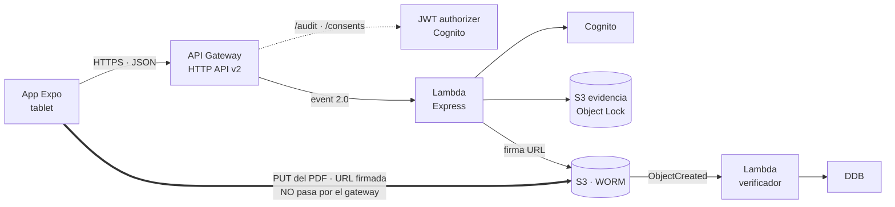

# API de consentimiento informado — ACR Vital Laboral

Backend del consentimiento médico firmado en tablet: **Express sobre Lambda**,
detrás de un **API Gateway HTTP API**, con Cognito y S3 por detrás. El registro de
auditoría son objetos inmutables en S3 bajo Object Lock; no hay base de datos.

Este archivo es el punto de entrada y el resumen de la entrega. El detalle está
en `docs/`, enlazado desde cada sección.

---

## Estado

| Pieza | Estado |
| --- | --- |
| App (Expo, tablet) | Emite las peticiones con la forma final del contrato |
| **API — 5 rutas** | **Implementado y probado** · 42 comprobaciones locales, 27 contra AWS |
| **Terraform del API Gateway** | **Revisado y corregido** · [`infra/api/api_gateway.tf`](infra/api/api_gateway.tf) |
| **Contenedor** | **Listo** · arranca simulado e imprime todo por consola |
| Cognito · S3 | **Desplegados** (infra/); sin variables, adaptadores simulados en memoria |

El API es hoy un **contrato ejecutable**: la app puede integrarse contra él,
recorrer el flujo completo de firma y ver en consola exactamente qué envía y qué
recibe. Lo que falta es infraestructura y cuatro decisiones — **no código**.

---

## Arranque

```bash
npm install
npm start          # http://localhost:3000, todo simulado
npm run smoke      # recorre el flujo completo contra el handler de Lambda
```

O sin instalar nada:

```bash
docker build -t acr-api . && docker run --rm -p 3000:3000 acr-api
```

En el `.env` de la app: `EXPO_PUBLIC_API_URL=http://<ip-del-equipo>:3000`.
Usuario de prueba: `demo@acrvitallaboral.com` / `Demo1234!`.

### Con S3 de verdad (emulado): LocalStack

```bash
pip install terraform-local        # tflocal; terraform y Docker Desktop ya instalados
node scripts/localstack.mjs
```

Levanta LocalStack, aplica **el mismo Terraform que en AWS** (`infra/bootstrap` e
`infra/platform`) con `tflocal`, y arranca el API apuntando a lo creado. Ejercita lo
que los stubs no cubren: el `PutItem` condicional, la consulta del GSI2 y la URL
firmada con checksum contra un S3 que la valida.

Cognito sigue simulado (en LocalStack es de pago) e `infra/api` no se aplica (ECR,
Lambda desde imagen y API Gateway v2 también). LocalStack Community no persiste:
tras un `--down`, el script vuelve a crear todo.

Docker Desktop en Windows necesita **WSL 2** para arrancar el engine. Sin WSL, el
engine nunca responde y ni LocalStack ni `docker build --target lambda` funcionan:
`wsl --install` como administrador, reiniciar, y en Docker Desktop → Settings →
General → *Use the WSL 2 based engine*.

### Lo que se ve en consola

Mientras no haya AWS detrás, cada petición imprime lo recibido, **la llamada que
se hará a AWS cuando el recurso exista**, y lo respondido:

```
▶ RECIBIDO  POST /audit/logs  #78817284  ip 190.85.12.34
cuerpo: { ..., "capture_metadata": { "operator_id": "mentira-del-cliente" } }
☁ AWS (simulado) S3.PutObject — evento nuevo (queda bajo Object Lock)
  entrada: { "TableName": "consent_audit_logs",
             "ConditionExpression": "attribute_not_exists(PK) AND attribute_not_exists(SK)",
             "Item": { "PK": "PATIENT#1018293847", "operator_id": "e68d4637-…",
                       "ip_address": "190.85.12.34", "pdf_verified": false } }
◀ ENVIADO   201 POST /audit/logs  #78817284  1 ms
```

Ese ejemplo enseña de paso lo que el servidor **no** deja decidir al
dispositivo: el `operator_id` que llegó en el cuerpo se descarta y se usa el del
token.

---

## Cómo se hablan las piezas



El orden del flujo de firma es obligatorio y la app ya lo respeta:

```
generar PDF → POST /consents { log, pdf_base64 } → verificado en la misma respuesta
```

Los diagramas de secuencia de cada flujo están en
[`RECOMENDACIONES_Y_PLAN.md` §2](docs/RECOMENDACIONES_Y_PLAN.md#2-diagramas-de-comunicación).

---

## Endpoints

| Ruta | Autorizador | Devuelve |
| --- | --- | --- |
| `POST /auth/login` | — | `200` `{token, refreshToken, user}` |
| `POST /auth/register` | — | `201` igual que login · **cerrado por defecto** |
| `POST /auth/refresh` | — | `200` `{token}` · todo fallo es `401`, nunca `403` |
| `POST /audit/logs` | JWT | `201` `{log_id}` · reenvío → `200 {duplicate:true}` |
| `POST /consents/{consent_id}/pdf-url` | JWT | `200` `{url, method, expires_in, headers}` |
| `GET /health` | — | `{status:"ok"}` · detalle solo fuera de producción |

Todo error responde exactamente `{ "message": "..." }`, en español y listo para
mostrar al usuario. Detalle de cada uno en
[`API_IMPLEMENTATION.md` §4](docs/API_IMPLEMENTATION.md#4-endpoints).

---

## El modelo de adaptadores

Cada servicio de AWS tiene dos implementaciones con la misma superficie:
`*.aws.js` (SDK v3) y `*.stub.js` (memoria). La elección se resuelve una vez, en
el arranque en frío:

| Servicio | Pasa a `aws` cuando… |
| --- | --- |
| Cognito | hay `COGNITO_USER_POOL_ID` **y** `COGNITO_CLIENT_ID` |
| Evidencia (S3) | hay `EVIDENCE_BUCKET` |
| S3 | hay `PDF_BUCKET` |

**Cuando exista la infraestructura no hay que tocar código: solo el `.env`.** Las
capas de rutas y servicios son idénticas en los dos lados.

Y el proceso **se niega a arrancar** con `NODE_ENV=production` y algún adaptador
simulado: un API de auditoría que responde `201` sin escribir nada es peor que un
API caído.

---

## Hallazgos

Los bloqueantes primero. El detalle técnico de cada uno está en
[`API_IMPLEMENTATION.md` §6](docs/API_IMPLEMENTATION.md#6-hallazgos-arquitectura-y-seguridad)
y [`REVISION_API_GATEWAY.md`](docs/REVISION_API_GATEWAY.md).

### Bloqueantes

| # | Hallazgo | Estado |
| --- | --- | --- |
| G1 | **`ANY /{proxy+}` con JWT dejaba `/auth/login` detrás del autorizador**: había que presentar un token para poder obtener un token. La app no habría podido iniciar sesión nunca | Corregido en el Terraform |
| A1 | **No había forma de buscar un log por `consent_id`**: `/pdf-url` no podía encontrarlo. Sin `Scan` de toda la tabla, imposible | Código listo; **falta crear el GSI2** |
| A2 | **`SECRET_HASH` del refresh necesita el username**, que la app no envía y el refresh token de Cognito no revela. Con app client con secreto, `/auth/refresh` no puede funcionar | Resuelto con un sobre; **decisión pendiente** |
| A3 | El **tipo de token** debe coincidir entre `COGNITO_TOKEN_FOR_APP` y el JWT authorizer, o toda ruta protegida da `401` | Verificar en Fase 3 |

### Seguridad

| # | Hallazgo | Estado |
| --- | --- | --- |
| S1 | **Auto-registro abierto**: cualquiera que alcance la URL creaba una cuenta confirmada de personal clínico y desde ahí escribía logs de consentimientos | Cerrado por defecto **y** sin publicar la ruta |
| S2 | El **`pdf_s3_key` del cliente** es una predicción; firmarla permitiría escribir en cualquier ruta del bucket | La clave la construye el servidor |
| S3 | Una **URL firmada sin límite de tamaño** es una escritura al portador | Se firma `content-length` |
| S4 | **`/auth/*` sin límite de tasa**. Un WAF no se puede asociar a un HTTP API v2 | Límite por ruta: 5 rps en login |
| S5 | **`/health` público** publicaba entorno y adaptadores activos | Mínimo en producción |
| S6 | Faltaba **`x-api-key` en `allow_headers`** y CORS estaba en `*` | Corregido |
| S7 | **Cédula en claro en la llave de partición**, con biometría y nombre en el mismo ítem (Ley 1581) | Recomendación abierta |

### De criterio

| # | Hallazgo | Decisión tomada |
| --- | --- | --- |
| C1 | El contrato pedía `409` en un reenvío del outbox, pero su ejemplo de código devolvía `200 {duplicate}`. Un `4xx` rompe la app: lo trata como definitivo y muestra error por un éxito | Se implementó el `200` |
| C2 | Express en un solo Lambda da a `/audit/logs` el mismo rol de IAM que a `/auth/register` | Aceptado; la estructura permite separarlo |
| C3 | El hash hace el documento **verificable**, no irrefutable | Sello de tiempo KMS/RFC 3161 si hay litigio |

---

## Las cuatro decisiones pendientes

Ninguna es técnica; todas cambian la infraestructura que hay que crear.

| Decisión | Recomendación |
| --- | --- |
| App client **con o sin secreto** | **Sin secreto.** Quien llama a Cognito es el Lambda, no el dispositivo; elimina A2 de raíz |
| **Auto-registro** | **Solo desde la consola.** El propio contrato ya contempla esta salida |
| **Tipo de token** | **Access token**, y el authorizer validando access tokens |
| **Retención documental** | Consultar la normativa **antes** de tocar cualquier regla de lifecycle |

---

## Plan de acción

Detalle, criterios de aceptación y checklists en
[`RECOMENDACIONES_Y_PLAN.md` §4](docs/RECOMENDACIONES_Y_PLAN.md#4-plan-de-acción).

| Fase | Qué |
| --- | --- |
| **0 — hoy** | La app se integra contra el contenedor simulado y compara payloads |
| **1** | Las cuatro decisiones de arriba |
| **2** | Crear Cognito, S3 de evidencia y de PDFs **con Object Lock al crearlos**, gateway |
| **3** | Encender los adaptadores **uno a uno**, comprobando `/health` entre pasos |
| **4** | Límite de tasa, logs de acceso, secretos, alarmas, CloudTrail |
| **5** | Retención, seudonimización, sello de tiempo |
| **6** | Pendientes de la app: outbox en SQLite, reintento del PDF, `expo-secure-store` |

Criterio de fin de la Fase 3: `/health` devuelve `"stubbed": []`.

---

## Mapa de archivos

```
README.md                     este archivo
docs/
  API_CONTRACT.md             el contrato original (entrada)
  API_IMPLEMENTATION.md       qué hace el código, endpoint por endpoint
  RECOMENDACIONES_Y_PLAN.md   diagramas, 18 recomendaciones, plan por fases
  REVISION_API_GATEWAY.md     revisión del Terraform propuesto
infra/bootstrap/              bucket del estado de Terraform (una vez por cuenta)
infra/platform/               S3 (evidencia, PDFs), Cognito — guarda datos, estado propio
infra/api/                    Lambda (.zip, nodejs22.x), API Gateway, IAM — se aplica en cada push
  api_gateway.tf              HTTP API corregido: rutas, CORS, logs, throttling
scripts/deploy.mjs            paquete .build/lambda (npm ci --omit=dev) → terraform apply; no necesita Docker
scripts/publish-template.mjs  formularios de consentimiento: check · publish · retire · list (docs/PLANTILLAS.md)
templates/                    fuente de los formularios (CA-F-14.json, …)
Dockerfile                    servidor Express en contenedor (opcional, solo local); la Lambda ya no usa imagen
.env.example                  todas las variables, comentadas
src/
  handlers/api.js             Lambda del gateway (evento 2.0 → Express)
  handlers/pdfVerifier.js     Lambda de s3:ObjectCreated
  app.js · local.js           ensamblado y servidor de desarrollo
  config/env.js               único punto que lee process.env
  routes/ services/           rutas finas · lógica del contrato
  aws/                        adaptadores AWS y simulados, con su selector
  middleware/ lib/            contexto, auth, CORS, errores, traza, validación
scripts/smoke.js              prueba end-to-end sobre el handler de Lambda
```

---

## Verificación

| Qué | Cómo | Estado |
| --- | --- | --- |
| El contrato completo | `npm run smoke` | **32/32 en verde** |
| Sintaxis de todo el código | `node --check` sobre `src/` y `scripts/` | **Correcto** |
| Servidor local y CORS | `npm start` + `curl` | **Correcto** |
| `/health` en producción | Responde `{"status":"ok"}` y nada más | **Correcto** |
| Imagen de Docker | `docker build` | **Sin verificar**: el engine de Docker Desktop no responde en este equipo |
| Terraform | `terraform validate` | **Sin verificar**: Terraform no está instalado en este equipo |

Las dos últimas filas están revisadas a mano, no ejecutadas.
