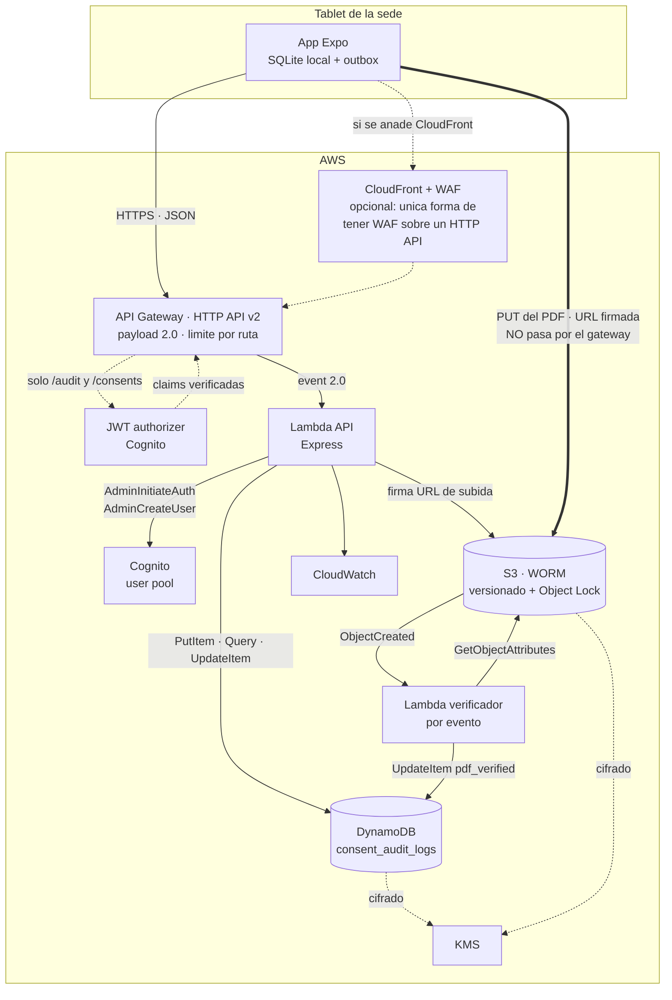
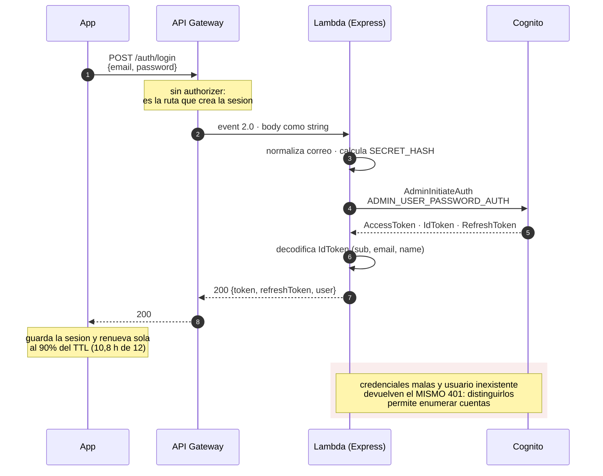
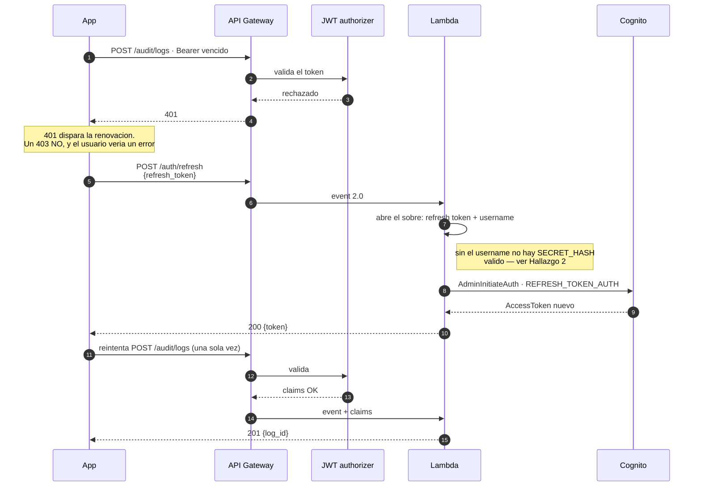
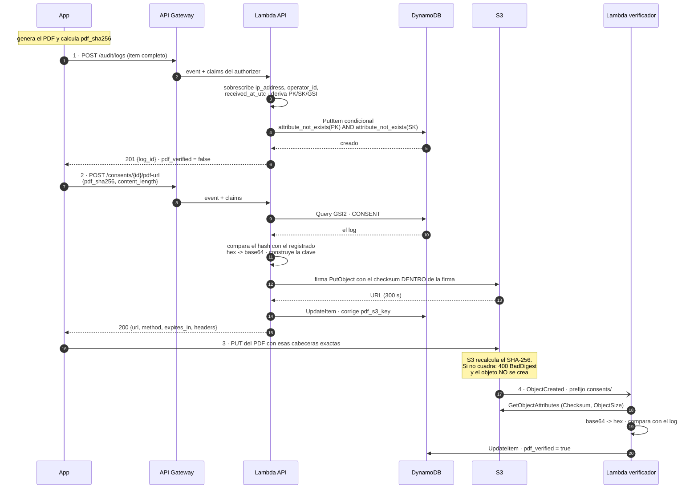
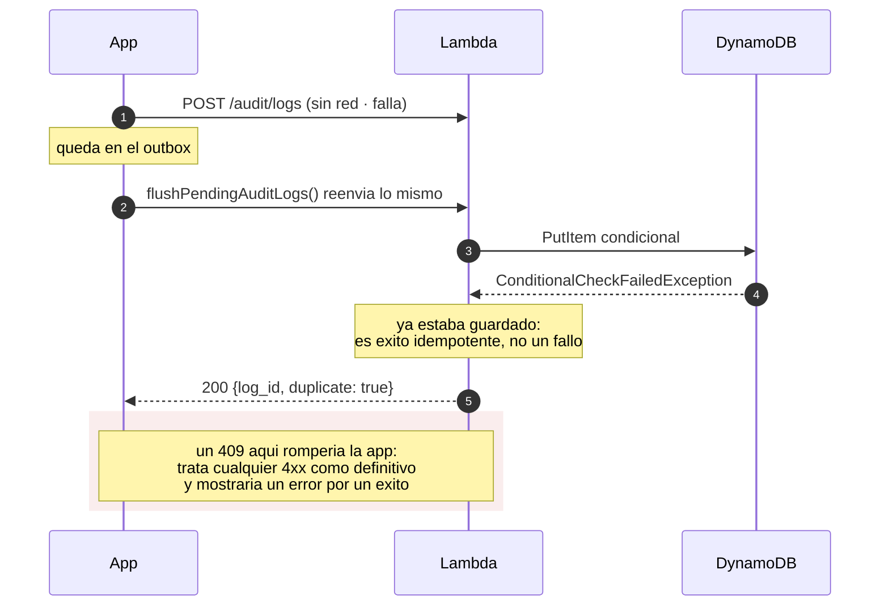
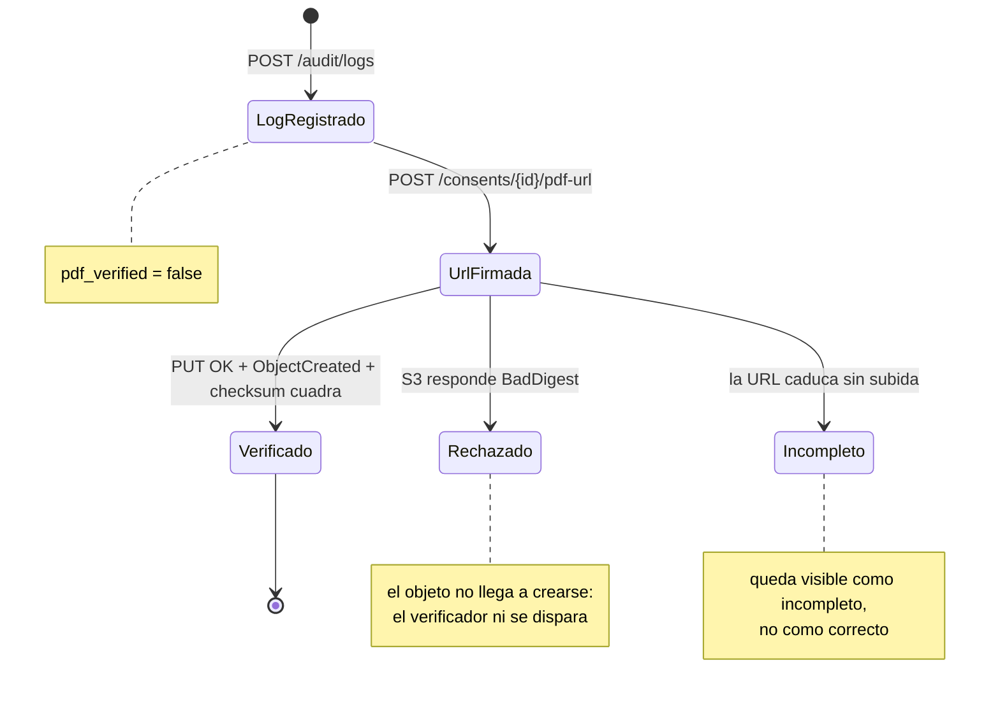
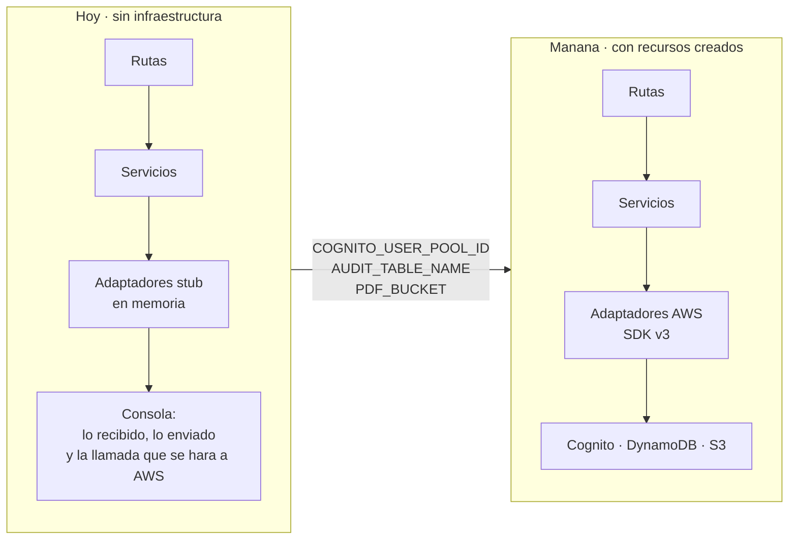

# Recomendaciones, plan de acción y diagramas de comunicación

> **Estado (2026-09-21): el registro de auditoría ya NO vive en DynamoDB.** Este
> documento describe el diseño anterior. La verdad es ahora S3 con Object Lock —
> eventos inmutables `events/<consent_id>/000N-*.json` más punteros de índice — y
> DynamoDB, su stream, el Lambda del rastro y la clave KMS se eliminaron. El diseño
> vigente está en `docs/PLAN_S3_COMPLIANCE.md` (ejecutado) y en `docs/API_CONTRACT.md`.

Complemento de [`API_CONTRACT.md`](API_CONTRACT.md) (el contrato) y de
[`API_IMPLEMENTATION.md`](API_IMPLEMENTATION.md) (lo que hace el código). Este
documento responde a tres preguntas: **cómo se hablan las piezas**, **qué hay que
arreglar** y **en qué orden**.

---

## 1. Dónde estamos

| Pieza | Estado |
| --- | --- |
| App (Expo, tablet) | Emite las peticiones con la forma final del contrato |
| API (5 rutas + verificador) | **Implementado y probado** — 33 comprobaciones end-to-end |
| Cognito · DynamoDB · S3 | **No existen**: adaptadores simulados en memoria |
| API Gateway (HTTP API) | Terraform revisado y corregido en `infra/api/api_gateway.tf` |
| Docker | Imagen lista, arranca simulado e imprime todo por consola |

El API es hoy un **contrato ejecutable**: la app puede integrarse contra él,
recorrer el flujo completo y ver en consola exactamente qué envía y qué recibe.
Lo que falta es infraestructura y cuatro decisiones, no código.

---

## 2. Diagramas de comunicación

### 2.1 Vista general



El PDF **no pasa por el gateway**: API Gateway corta en 10 MB y Lambda en 6 MB de
payload síncrono, y reenviar bytes por Lambda es cómputo pagado a cambio de nada.
La app pide una URL firmada de vida corta y sube el archivo directo a S3.

### 2.2 Inicio de sesión



### 2.3 Renovación y reintento transparente ante un 401



### 2.4 Firma de un consentimiento: el flujo completo

El orden es obligatorio y la app ya lo respeta.



Ese paso 4 es el que convierte el hash de *afirmación del dispositivo* en *hecho
verificado por infraestructura que la clínica no opera*. Un consentimiento cuyo
PDF nunca llegó queda visiblemente incompleto en vez de silenciosamente correcto.

### 2.5 Reenvío del outbox



### 2.6 Ciclo de vida de la verificación del PDF



### 2.7 Hoy frente a mañana: lo que cambia es el `.env`, no el código



Las capas de rutas y servicios son **las mismas** en los dos lados. Lo único que
cambia es qué implementación devuelve `src/aws/index.js`, y eso lo decide una
variable de entorno.

---

## 3. Recomendaciones priorizadas

`E` = esfuerzo estimado. **B** = bloquea el despliegue.

| # | Recomendación | Severidad | E | Estado |
| --- | --- | --- | --- | --- |
| R1 | Crear el **GSI2 `CONSENT#<id>`**: sin él `/pdf-url` no puede encontrar el log | **B** | 1 h | Código listo; falta el índice |
| R2 | Decidir **app client con o sin secreto** y fijar `COGNITO_REFRESH_USERNAME_MODE` | **B** | 2 h | Sobre implementado por defecto |
| R3 | Alinear el **tipo de token** (`COGNITO_TOKEN_FOR_APP`) con el JWT authorizer | **B** | 30 min | `access` por defecto |
| R4 | Mantener el **auto-registro cerrado** o exigir código de invitación | **Alta** | 1 h | `REGISTRATION_ENABLED=false` |
| R5 | **Throttling por ruta** en `/auth/*` + threat protection de Cognito. WAF **no** se puede asociar a un HTTP API v2: requiere CloudFront delante | **Alta** | 4 h | Corregido en `infra/api/api_gateway.tf` |
| R6 | **Cifrar con CMK propia** DynamoDB y S3; CloudTrail de plano de datos | **Alta** | 4 h | Infraestructura |
| R7 | **Object Lock al crear el bucket** — después es imposible | **Alta** | 1 h | Infraestructura |
| R8 | Secretos en **Secrets Manager**, nunca en variables planas | **Alta** | 2 h | Infraestructura |
| R9 | Definir la **retención documental** antes de cualquier regla de lifecycle | **Alta** | — | Decisión legal |
| R10 | Seudonimizar la cédula en `PK` (HMAC con llave en KMS) | Media | 1 d | Requiere migrar datos |
| R11 | **Alarmas**: 5xx, latencia p99, `pdf_verified=false` con más de 24 h | Media | 3 h | Infraestructura |
| R12 | **Sello de tiempo** (KMS `Sign` o RFC 3161) para no repudio | Media | 1 d | Solo si hay riesgo de litigio |
| R13 | Separar `auth` de `audit+consents` en dos Lambdas por IAM | Media | 4 h | La estructura ya lo permite |
| R14 | **PITR** en la tabla y plan de restauración probado | Media | 1 h | Infraestructura |
| R15 | Pendientes de la app: outbox en SQLite, reintento del PDF, `expo-secure-store` | Media | 3 d | Lado app |
| R16 | Pruebas en tablet **con lápiz**: presión real y subida real | Media | 1 d | Lado app |
| R17 | CORS en el gateway y no en el código, en producción | Baja | 1 h | Infraestructura |
| R18 | Infraestructura como código (CDK o Terraform) en vez de consola | Baja | 2 d | Recomendado |

El detalle técnico de R1–R4 está en [`API_IMPLEMENTATION.md` §6](API_IMPLEMENTATION.md#6-hallazgos-arquitectura-y-seguridad).

---

## 4. Plan de acción

```mermaid
gantt
    title Orden recomendado
    dateFormat X
    axisFormat %s
    section Decisiones
    Cuatro decisiones que bloquean    :done, d1, 0, 2
    section Infraestructura
    Cognito                           :i1, 2, 3
    DynamoDB + GSI2                   :i2, 2, 3
    S3 WORM + KMS                     :i3, 3, 3
    API Gateway + authorizer          :i4, 5, 2
    section Conexion
    Encender drivers uno a uno        :c1, 7, 3
    Pruebas en tablet                 :c2, 10, 3
    section Endurecimiento
    WAF, alarmas, secretos            :e1, 10, 4
    Cumplimiento y no repudio         :e2, 14, 4
```



### Fase 0 — Integrar ya, sin AWS *(disponible hoy)*

**Objetivo:** que la app deje de trabajar a ciegas.

```bash
docker build -t acr-api .
docker run --rm -p 3000:3000 acr-api
```

Y en el `.env` de la app: `EXPO_PUBLIC_API_URL=http://<ip-del-equipo>:3000`.

Cada petición imprime en consola lo recibido, lo respondido **y la llamada que se
hará a AWS cuando exista**:

```
▶ RECIBIDO  POST /auth/login  #36090e64  ip 190.85.12.34
cuerpo: { "email": "demo@acrvitallaboral.com", "password": "«oculto»" }
☁ AWS (simulado) Cognito.AdminInitiateAuth — ADMIN_USER_PASSWORD_AUTH
  entrada: { "UserPoolId": "«COGNITO_USER_POOL_ID sin definir»", ... }
◀ ENVIADO   200 POST /auth/login  #36090e64  7 ms
```

- [ ] La app completa el flujo de firma contra el API simulado
- [ ] El payload de `/audit/logs` de Metro coincide con el que imprime el API
- [ ] `npm run smoke` en verde

**Criterio de aceptación:** la app llega hasta el `PUT` a S3 (que falla por red,
como debe: no hay bucket) sin ningún error de contrato.

### Fase 1 — Las cuatro decisiones que bloquean

Ninguna es técnica; todas cambian la infraestructura que hay que crear.

| Decisión | Opciones | Recomendación |
| --- | --- | --- |
| **App client con secreto** | con / sin | **Sin secreto.** Quien llama a Cognito es el Lambda, no el dispositivo; el secreto aporta poco y complica el refresh (R2) |
| **Auto-registro** | abierto / código de invitación / solo consola | **Solo consola.** El contrato ya contempla esta salida (R4) |
| **Tipo de token** | access / id | **Access**, y que el authorizer valide access tokens (R3) |
| **Retención documental** | según normativa | Consultar antes de tocar lifecycle (R9) |

- [ ] Las cuatro decisiones tomadas y escritas en este documento

### Fase 2 — Crear la infraestructura

**Cognito**
- [ ] User pool: `email` como alias, atributo `name`
- [ ] App client con `ALLOW_ADMIN_USER_PASSWORD_AUTH`, según la decisión de Fase 1
- [ ] Access token 12 h · refresh token 30 días
- [ ] `EXPO_PUBLIC_AUTH_TOKEN_TTL_HOURS=12` en la app **coincidiendo** con lo anterior

**DynamoDB**
- [ ] Tabla `consent_audit_logs`, on-demand, PITR
- [ ] GSI1 `CLINIC#<sede>` / `LOG#<iso>` · proyección `INCLUDE`
- [ ] **GSI2 `CONSENT#<id>` / `LOG#<iso>`** · `INCLUDE` con `PK`, `SK`, `consent_id`, `signature_data`, `timestamp_utc` (R1)
- [ ] Cifrado con CMK propia (R6)

**S3**
- [ ] Bucket con versionado **y Object Lock activado al crearlo** (R7)
- [ ] Cifrado KMS · bloqueo total de acceso público
- [ ] Notificación `ObjectCreated:*` con prefijo `consents/` hacia el verificador

**API Gateway y Lambda**
- [ ] HTTP API, integración proxy **payload 2.0**, stage `$default`
- [ ] JWT authorizer sobre `/audit/*` y `/consents/*`; **nada** sobre `/auth/*`
- [ ] Dos funciones: `api.handler` y `pdfVerifier.handler`
- [ ] Rol de IAM por función según la tabla de [`API_IMPLEMENTATION.md` §7](API_IMPLEMENTATION.md#7-lista-de-comprobación-de-infraestructura)

### Fase 3 — Encender los adaptadores, uno a uno

**En este orden**, y comprobando `/health` después de cada paso: dice qué
adaptador está activo en cada servicio.

1. **Cognito** → definir `COGNITO_USER_POOL_ID` y `COGNITO_CLIENT_ID`
   - [ ] `/auth/login` con un usuario real
   - [ ] `/auth/refresh` devuelve token nuevo — **aquí se ve si R2 quedó bien resuelto**
   - [ ] Credenciales malas siguen dando `401` con el mensaje genérico
2. **DynamoDB** → definir `AUDIT_TABLE_NAME`
   - [ ] Un log llega a la tabla con `ip_address`, `operator_id` y `received_at_utc` puestos por el servidor
   - [ ] El reenvío del mismo log responde `200 duplicate` y **no** duplica el ítem
3. **S3** → definir `PDF_BUCKET`
   - [ ] La URL firmada acepta el PDF correcto
   - [ ] Un PDF alterado es rechazado por S3 con `BadDigest`
   - [ ] El verificador deja `pdf_verified = true` en menos de un minuto
4. **Quitar** `ALLOW_STUB_IN_PRODUCTION` y desplegar con `NODE_ENV=production`
   - [ ] Con `TRACE_IO` apagado: en producción el logger estructurado es el que sirve

**Criterio de aceptación:** `/health` devuelve `"stubbed": []`.

### Fase 4 — Endurecimiento

- [ ] Throttling por ruta en el stage: 5 rps en `/auth/login` (R5)
- [ ] Threat protection de Cognito, o CloudFront + WAF si se quiere limite por IP (R5)
- [ ] Secretos en Secrets Manager (R8)
- [ ] CORS movido al gateway (R17)
- [ ] Alarmas: 5xx, latencia p99, `pdf_verified=false` con más de 24 h (R11)
- [ ] CloudTrail de plano de datos sobre la tabla y el bucket (R6)
- [ ] Restauración desde PITR **probada**, no solo activada (R14)

### Fase 5 — Cumplimiento y no repudio

- [ ] Retención documental configurada según R9
- [ ] Seudonimización de la cédula, si se decide (R10)
- [ ] Sello de tiempo con KMS `Sign` sobre `{pdf_sha256, timestamp, consent_id}` (R12)
- [ ] Procedimiento escrito de "cómo se demuestra este consentimiento ante un tercero"

### Fase 6 — Pendientes del lado de la app

- [ ] Outbox de auditoría en SQLite (hoy vive en memoria y se pierde al reiniciar)
- [ ] `flushPendingAuditLogs()` al arrancar y después de cada login
- [ ] Reintentar la subida del PDF igual que el log
- [ ] Sesión en `expo-secure-store`
- [ ] Pruebas en tablet con lápiz: presión real y subida real (R16)

---

## 5. Riesgos abiertos

| Riesgo | Impacto | Mitigación |
| --- | --- | --- |
| Se despliega a producción con adaptadores simulados | Consentimientos que responden `201` sin guardarse | Ya cubierto: el proceso **se niega a arrancar**; solo `ALLOW_STUB_IN_PRODUCTION=true` lo permite |
| El TTL del token y el de la app no coinciden | Una petición perdida en cada desfase | Fijar los dos a 12 h y verificarlo en Fase 3 |
| Object Lock no se activa al crear el bucket | Imposible de añadir después: hay que rehacer el bucket | Lista de comprobación de Fase 2 |
| El GSI2 no se crea | `/pdf-url` responde `404` siempre | Fase 2; se detecta en el paso 3 de Fase 3 |
| Auto-registro abierto en producción | Cualquiera crea cuentas de personal clínico | Cerrado por defecto (R4) |
| Un access token de 12 h robado | 12 h de acceso con la identidad del profesional | Es el precio de cubrir la jornada; mitigar con WAF y revisión de CloudTrail |

---

## 6. Cómo se verifica todo esto

| Qué | Cómo |
| --- | --- |
| El contrato completo | `npm run smoke` — 33 comprobaciones sobre el handler de Lambda |
| Qué adaptador está activo | `GET /health` → `stubbed: []` cuando todo es real |
| Lo que recibe y responde el API | Consola, con `TRACE_IO=true` (encendido solo con adaptadores simulados) |
| El cuerpo completo sin recortes | `TRACE_FULL=true` |
| Los valores sin ocultar | `TRACE_REDACT=false` — **solo en local**, imprime contraseñas y tokens |
| El handler real de Lambda | `docker build --target lambda` + emulador de runtime |
